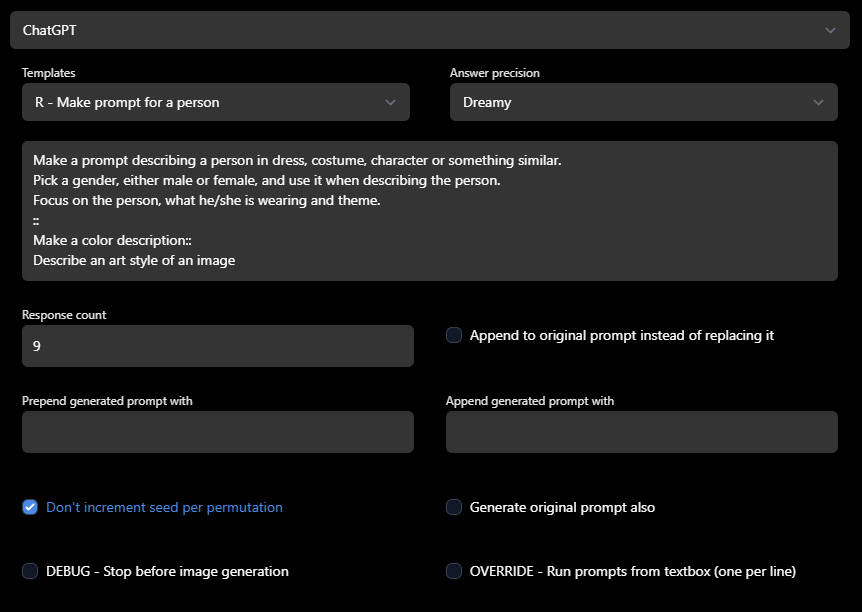
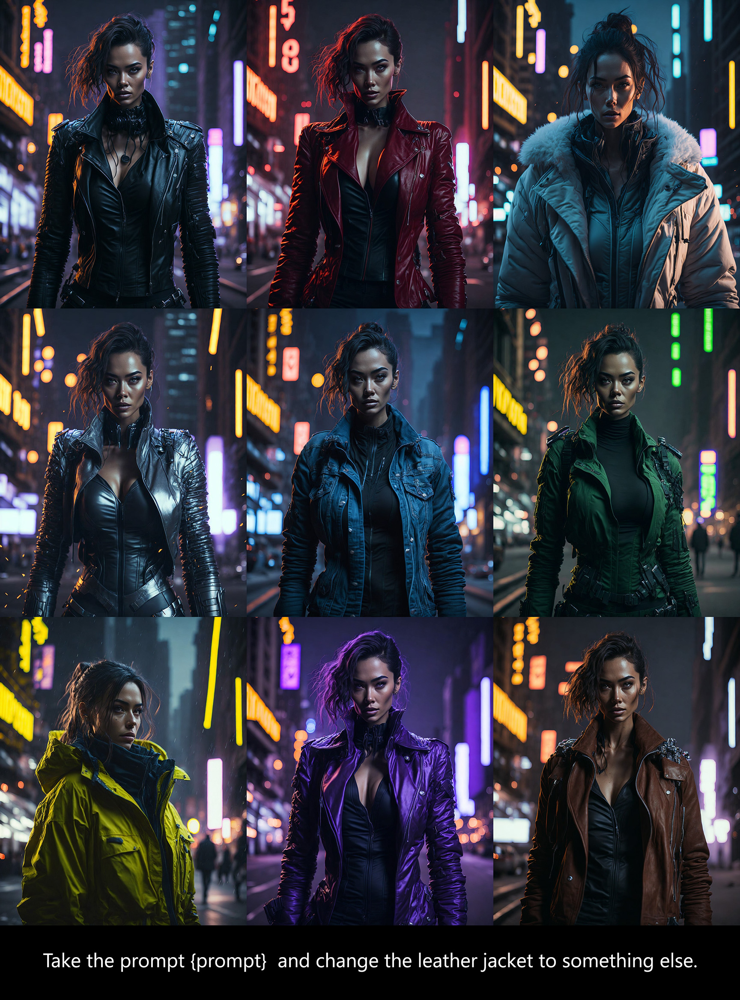
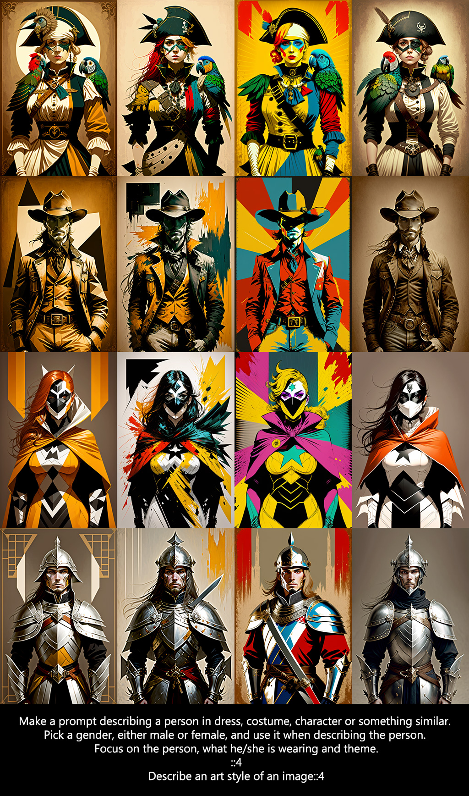

# stable-diffusion-webui-chatgpt-utilities
This an extension for [stable-diffusion-webui](https://github.com/AUTOMATIC1111/stable-diffusion-webui) that enables you to use ChatGPT for prompt variations, inspiration and pretty much anything you can think of.

## Installation & Setup

- Go to the directory \<stable-diffusion-webui project path\>/extensions and run command  to install: `git clone https://github.com/hallatore/stable-diffusion-webui-chatgpt-utilities` and restart your stable-diffusion-webui.
[See here for more install details](https://github.com/AUTOMATIC1111/stable-diffusion-webui/wiki/Extensions)

- Add your OpenAI API Key in Settings/ChatGPT Utilities within the web ui. You need a paying account at  [OpenAI](https://platform.openai.com/account/billing/overview).

- Enable ChatGPT under scripts

## Usage

ChatGPT is quite fluid/dynamic/analog in it's responses. So play around with what questions works best. ChatGPT response is printed in the console, so you can check what it generated there and interupt SD if it's too off.

Use the templates to play around and see what is possible.

PS: {prompt} is a special key and will insert the original prompt in your ChatGPT request.

### Multiprompt

You can split a prompt into multiple parts by using `::`. 
This is useful if ChatGPT has a hard time returning a complex prompt.

> Example: `Make a prompt describing an old cabin in the woods:: Make a color description`

You can also add a number behind to get a certain amount of results. This will result in a combination of all possible solutions. 
The following example would give you 12 (4*3) images.

> Example: `Make a prompt describing an old cabin in the woods::4 Make a color description::3`

## Examples

